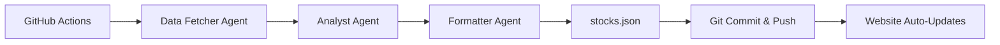

# Stock Data Automation

This directory contains the Crew.ai automation for updating stock data weekly.

## Overview

The automation uses three AI agents:
1. **Data Fetcher** - Fetches current stock prices and financial metrics
2. **Analyst** - Calculates DCF valuations and assigns factor scores (1-5)
3. **Formatter** - Formats data into valid JSON for the website

## Setup

### 1. Install Dependencies

```bash
cd automation
pip install -r requirements.txt
```

### 2. Configure Environment Variables

Copy the example env file:
```bash
cp .env.example .env
```

Edit `.env` and add your OpenRouter API key plus any overrides:
```
OPENROUTER_API_KEY=your-actual-api-key-here
CREW_MODEL=anthropic/claude-3.5-sonnet        # optional
CREW_TICKERS=DUOL,CMG,ADBE,...               # optional comma-separated list
# or set OPENROUTER_MODEL=anthropic/claude-3.5-sonnet
```

Get a free API key at: https://openrouter.ai/keys

**Why OpenRouter?**
- Access to multiple AI models (GPT-4, Claude, Gemini, Llama, etc.)
- Competitive pricing (often cheaper than OpenAI direct)
- Free models available (e.g., Gemini 2.0 Flash)
- Single API for all models

### 3. Run Manually (Optional)

Test the automation locally:
```bash
python main.py
```

This will:
- Fetch latest stock prices
- Analyze fundamentals and calculate DCF valuations
- Generate `output/stocks.json`
- Copy the file to `../data/stocks.json` (website data source)

## GitHub Actions (Automated Weekly Updates)

The automation runs automatically every Sunday at 6:00 AM UTC via GitHub Actions.

### Required GitHub Secret

Add `OPENROUTER_API_KEY` to your GitHub repository secrets:
1. Go to Settings → Secrets and variables → Actions
2. Click "New repository secret"
3. Name: `OPENROUTER_API_KEY`
4. Value: Your OpenRouter API key (from https://openrouter.ai/keys)
5. Click "Add secret"

### Manual Trigger

You can manually trigger the workflow:
1. Go to Actions tab
2. Select "Update Stock Data Weekly"
3. Click "Run workflow"

## How It Works



1. **Weekly Schedule**: GitHub Actions triggers every Sunday
2. **Agent Workflow**: Crew.ai orchestrates three agents sequentially
3. **Data Update**: New `data/stocks.json` is generated
4. **Auto-Commit**: Changes are committed and pushed
5. **Deploy**: GitHub Pages automatically redeploys with fresh data

## Tracked Stocks

The automation discovers and tracks tickers mentioned by YouTube finance influencers:
- Currently configured channels are in `config/channels.json`
- New tickers are automatically discovered from video analysis
- Default tracked tickers: DUOL, CMG, ADBE, MELI, CRWV, CRM, SPGI, EFX, NFLX, ASML, MA

To add/remove tickers, edit `TICKERS` list in `crew_config.py` or the `data/stocks.json` file.

## Data Sources

The automation uses **yfinance** (Yahoo Finance API) for real-time stock data:

**`tools/market_data_tools.py`** provides:
- **Stock Price Fetcher** - Real-time prices for all tickers
- **Financial Data Scraper** - 30+ financial metrics per stock:
  - Valuation: Market cap, P/E ratios, enterprise value
  - Profitability: Margins, ROE, ROA, revenue growth
  - Cash Flow: Free cash flow, operating cash flow
  - Balance Sheet: Debt, cash, ratios
  - Dividends: Yield, payout ratio, history

The analyst agent combines this real data with AI reasoning to calculate DCF valuations and quality scores.

## Costs

Using default free model (Gemini 2.0 Flash):
- **OpenRouter API**: **$0.00** (free tier)
- **GitHub Actions**: **$0.00** (2,000 free minutes/month)
- **Total**: **$0.00/month** 🎉

Using paid models:
- **GPT-4o-mini**: ~$0.10-0.30 per run → ~$1-1.50/month
- **Claude 3.5 Sonnet**: ~$0.20-0.50 per run → ~$2-3/month
- **Llama 3.3 70B**: ~$0.05-0.15 per run → ~$0.50-1/month

See pricing at: https://openrouter.ai/models

## Troubleshooting

### Workflow fails with "OPENROUTER_API_KEY not found"
- Add the secret in GitHub Settings → Secrets and variables → Actions
- Make sure it's named exactly `OPENROUTER_API_KEY`

### No changes committed
- The workflow only commits if `data/stocks.json` changed
- Check action logs for agent outputs

### Invalid JSON generated
- Check `automation/output/stocks.json` for syntax errors
- The formatter agent should produce valid JSON, but verify manually if needed

### Manual run doesn't copy file
- Ensure you're in the `automation` directory when running
- Check that `../data/stocks.json` path is correct
