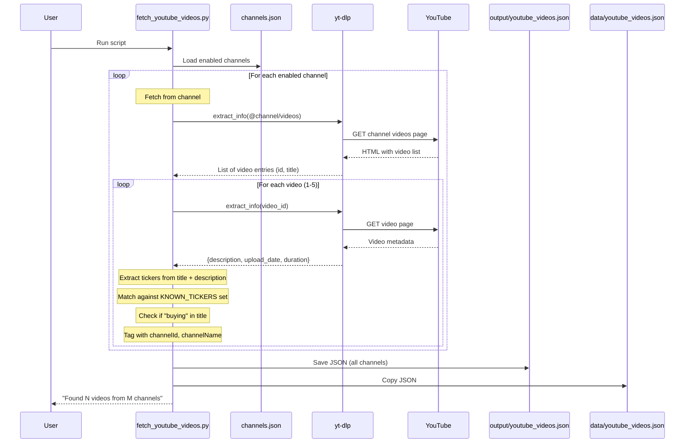

# YouTube Influencer Stock Tracker - Sequence Diagram

## Multi-Channel Workflow

The automation supports multiple YouTube finance channels configured in `config/channels.json`.

## Option 1: Fast Mode (Python only)


## Option 2: Enhanced Mode (Python + CrewAI)
```mermaid
sequenceDiagram
    participant User
    participant main.py
    participant discover_tickers.py
    participant fetch_youtube_videos.py
    participant yt-dlp
    participant YouTube
    participant CrewAI
    participant YoutubeVideoSearchTool
    participant LLM (OpenRouter)
    participant stocks.json

    User->>main.py: Run main.py

    Note over main.py: Step 1: Pre-fetch from all channels

    main.py->>fetch_youtube_videos.py: fetch_all_channels()
    fetch_youtube_videos.py->>yt-dlp: Get videos from each channel
    yt-dlp->>YouTube: Fetch video list + details
    YouTube-->>yt-dlp: Video metadata with channelName
    yt-dlp-->>fetch_youtube_videos.py: Videos with source attribution
    fetch_youtube_videos.py-->>main.py: All videos

    Note over main.py: Step 2: Discover new tickers

    main.py->>discover_tickers.py: discover_new_tickers(videos)
    discover_tickers.py->>stocks.json: Load currently tracked stocks
    Note over discover_tickers.py: Compare video tickers vs tracked
    discover_tickers.py-->>main.py: New tickers + existing updates

    Note over main.py: Step 3: Add new tickers to tracking

    main.py->>discover_tickers.py: add_new_tickers_to_stocks()
    discover_tickers.py->>stocks.json: Add placeholder entries
    discover_tickers.py-->>main.py: Updated stocks list

    Note over main.py: Step 4: Analyze with CrewAI

    main.py->>CrewAI: Start crew with all tickers
    CrewAI->>CrewAI: Load pre-fetched data from JSON
    end

    CrewAI->>output/youtube_videos.json: Save enhanced JSON
    CrewAI-->>main.py: Done
    main.py-->>User: Complete analysis
```

## Comparison

| Aspect | Fast Mode (Python) | Enhanced Mode (+CrewAI) |
|--------|-------------------|------------------------|
| Speed | ~10 seconds | ~2-5 minutes |
| API Cost | Free | Uses LLM tokens |
| Ticker Detection | From title/description only | From video transcript |
| Summary Quality | Template-based | LLM-generated, contextual |
| Insights | Generic | Specific to video content |

## When to Use Which

**Use Fast Mode** (`python fetch_youtube_videos.py`):
- Quick updates
- No API credits available
- Just need basic video info + thumbnails

**Use Enhanced Mode** (`python main.py`):
- Want detailed analysis
- Need accurate ticker extraction from actual video
- Want specific, contextual summaries
- Want automatic ticker discovery from new recommendations

## Flow Description

### 1. Channel Discovery
The script loads channels from `config/channels.json`:
- Multiple channels supported
- Each channel has: id, name, handle, enabled flag
- Only enabled channels are fetched

### 2. Video List Fetch
Using `yt-dlp` with `extract_flat=True`:
- Fast extraction without downloading
- Gets video IDs and titles for the 5 most recent videos per channel
- Tags each video with `channelId` and `channelName`

### 3. Per-Video Details (optional)
For each video, fetches full metadata:
- Video description (contains ticker mentions)
- Upload date
- Duration

### 4. Ticker Extraction
```python
KNOWN_TICKERS = {'AAPL', 'MSFT', 'GOOGL', 'AMZN', 'META', 'NVDA', ...}

# From title: "Top Five AI Stocks I'm Buying Now"
# From description: "...discussing AMZN, COST, and NOW..."
# Result: tickersMentioned = ['AMZN', 'COST', 'NOW']
```

### 5. Ticker Discovery (Enhanced Mode)
Compares video tickers against currently tracked stocks:
- Identifies new recommendations not yet in stocks.json
- Tracks which channel recommended each stock
- Auto-adds new tickers with placeholder data

### 6. Output
Saves structured JSON with:
```json
{
  "videoId": "--P9ha_OTJA",
  "title": "6 Stocks To Buy In An Overvalued Market",
  "publishedAt": "2025-11-05",
  "thumbnail": "https://img.youtube.com/vi/--P9ha_OTJA/maxresdefault.jpg",
  "tickersMentioned": ["META", "AMZN", "COST"],
  "tickersBought": [],
  "tickersRecommended": ["META", "AMZN", "COST"],
  "summary": "Joseph analyzes current market valuations...",
  "keyInsights": ["Market valuations are elevated - focus on quality"]
}
```
